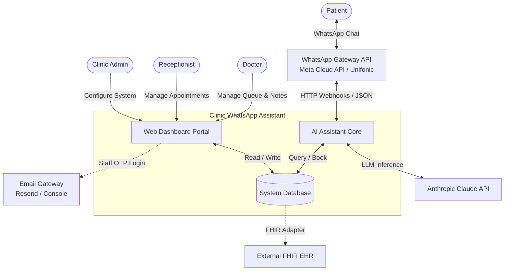
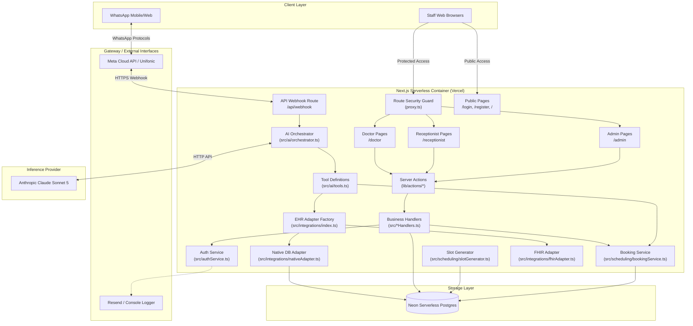
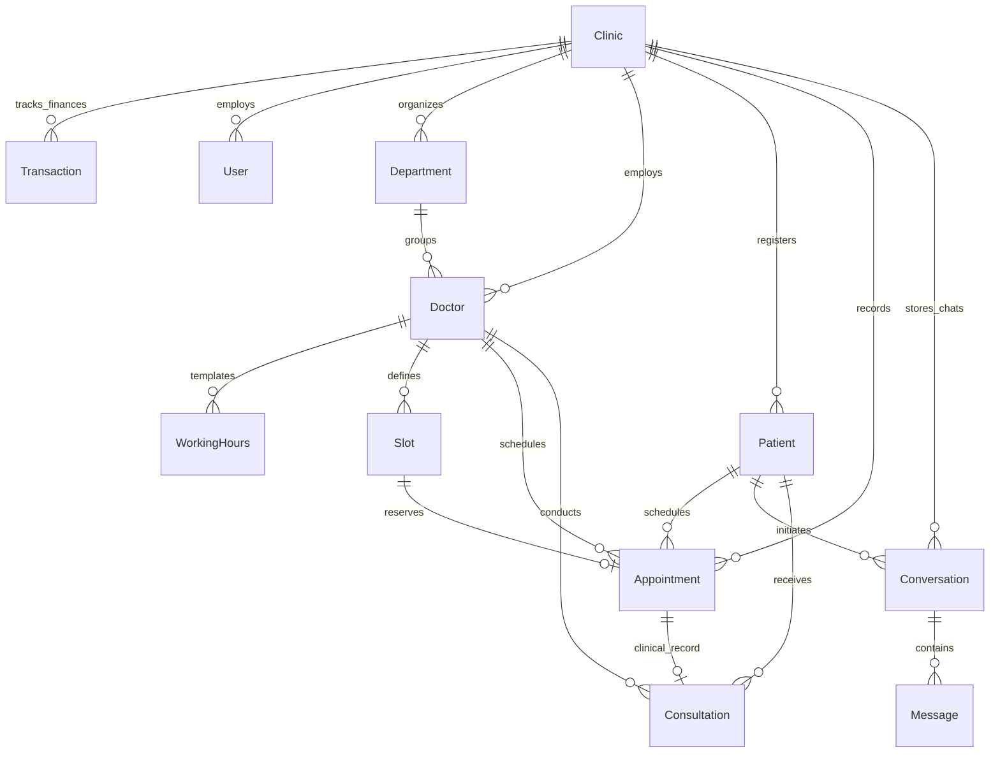
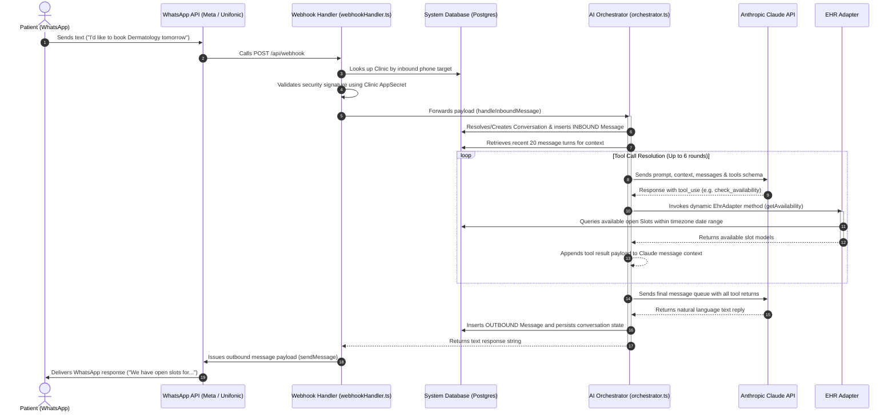
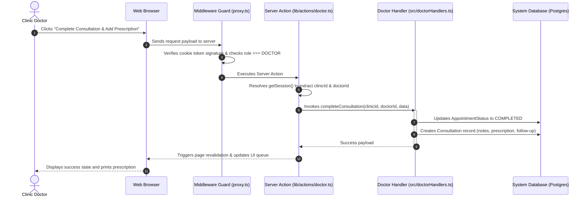

# System Architecture Document: Clinic WhatsApp Assistant

This document outlines the software and system architecture of the **Clinic WhatsApp Assistant** project. It is authored from the perspective of a Solution Architect, focusing on tenant isolation, clinical safety, integration extensibility, transactional integrity, and serverless hosting paradigms.

---

## Table of Contents
1. [System Context & Overview](#1-system-context--overview)
2. [Container & Component Architecture](#2-container--component-architecture)
3. [Core Architectural Pillars](#3-core-architectural-pillars)
   - [A. Multi-Tenancy & Tenant Isolation](#a-multi-tenancy--tenant-isolation)
   - [B. AI Agent Reliability & The Tool-Use Guardrail](#b-ai-agent-reliability--the-tool-use-guardrail)
   - [C. EHR Integration Seam (Open-Closed Principle)](#c-ehr-integration-seam-open-closed-principle)
   - [D. Resilient Scheduling & Booking Transaction](#d-resilient-scheduling--booking-transaction)
   - [E. Timezone Sanitization](#e-timezone-sanitization)
   - [F. Passwordless Session Security](#f-passwordless-session-security)
4. [Data Architecture & Schema](#4-data-architecture--schema)
5. [Key Execution Flows](#5-key-execution-flows)
   - [A. Inbound Message Sequence](#a-inbound-message-sequence)
   - [B. Staff Action / Dashboard Flow](#b-staff-action--dashboard-flow)
6. [Deployment & Infrastructure Topology](#6-deployment--infrastructure-topology)

---

## 1. System Context & Overview

The **Clinic WhatsApp Assistant** is a multi-tenant SaaS application that enables medical clinics to manage their scheduling operations via three role-scoped dashboards, while offering their patients an interactive, multilingual (English and Arabic) AI receptionist running natively inside **WhatsApp**.



---

## 2. Container & Component Architecture

The codebase leverages **Next.js 16** as a unified serverless application structure. The same bundle serves frontend pages, server actions, and HTTP API route endpoints.



---

## 3. Core Architectural Pillars

### A. Multi-Tenancy & Tenant Isolation
From day one, the architecture is multi-tenant. Every table in [schema.prisma](file:///Users/silpapremachandran/Documents/inv/clinic-whatsapp-assistant/prisma/schema.prisma) links back to a central `Clinic` model either directly or transitively.
* **Security Guardrails**: Cross-tenant data leaks are prevented by eliminating client-submitted fields (such as hidden form values) for identifiers like `clinicId` and `doctorId`. Instead, the system parses, decrypts, and extracts the tenant state server-side from the verified cookie session via [getSession](file:///Users/silpapremachandran/Documents/inv/clinic-whatsapp-assistant/lib/session.ts#L10-L14) and [proxy.ts](file:///Users/silpapremachandran/Documents/inv/clinic-whatsapp-assistant/proxy.ts#L16-L49).
* **Multi-App Config**: Metadata credentials (Meta App Access Tokens, App Secrets, and verify tokens) are stored in the `Clinic` record, allowing each tenant to host their own custom WhatsApp Business number.

### B. AI Agent Reliability & The Tool-Use Guardrail
To ensure patient safety and avoid standard LLM limitations (e.g. hallucinating open slot availability or confirming bookings outside of actual schedules), the AI assistant is designed around strict **Tool-Use**.
* The LLM operates purely as a routing and natural language interface. It does **not** have authorization to modify or check appointments directly; it is bound to the exact schemas exposed in [src/ai/tools.ts](file:///Users/silpapremachandran/Documents/inv/clinic-whatsapp-assistant/src/ai/tools.ts#L8-L73).
* The orchestrator in [src/ai/orchestrator.ts](file:///Users/silpapremachandran/Documents/inv/clinic-whatsapp-assistant/src/ai/orchestrator.ts#L18-L135) manages a multi-turn conversation loop (up to 6 rounds), matching natural language strings into tools like `check_availability`, `book_slot`, `cancel_appointment`, or `escalate_to_human`.
* Language negotiation occurs on the first interaction ([detectLocaleFromReply](file:///Users/silpapremachandran/Documents/inv/clinic-whatsapp-assistant/src/ai/orchestrator.ts#L146-L150)), loading a locale-specific system prompt ([src/ai/systemPrompt.ts](file:///Users/silpapremachandran/Documents/inv/clinic-whatsapp-assistant/src/ai/systemPrompt.ts)) that enforces medical and billing guardrails.

### C. EHR Integration Seam (Open-Closed Principle)
Many clinics already use established EHRs or scheduling portals. Rather than forcing a costly data migration, the system isolates scheduling lookups behind the [EhrAdapter](file:///Users/silpapremachandran/Documents/inv/clinic-whatsapp-assistant/src/integrations/ehrAdapter.ts#L29-L46) interface.
* **Seam Abstractions**: The orchestrator and booking operations communicate exclusively with the abstract interface.
* **Available Adapters**:
  1. [NativeAdapter](file:///Users/silpapremachandran/Documents/inv/clinic-whatsapp-assistant/src/integrations/nativeAdapter.ts): Serves our local Postgres DB (default behavior for greenfield clinics).
  2. [FhirAdapter](file:///Users/silpapremachandran/Documents/inv/clinic-whatsapp-assistant/src/integrations/fhirAdapter.ts): Integrates with HL7/FHIR systems (such as national health portals like Saudi Arabia's NPHIES).
  3. **SheetsAdapter**: Google Sheets integration (extensibility placeholder).
* **Factory Pattern**: The [getEhrAdapter](file:///Users/silpapremachandran/Documents/inv/clinic-whatsapp-assistant/src/integrations/index.ts#L9-L22) factory evaluates the clinic's `integrationMode` at runtime and returns the corresponding concrete adapter instance.

### D. Resilient Scheduling & Booking Transaction
Scheduling systems must handle heavy concurrent traffic without risk of double-booking. The scheduling engine uses a multi-tier approach:
1. **Pre-Materialization**: Instead of dynamic, ad-hoc scheduling calculations, slots are pre-allocated up to 30 days out via [generateSlotTimes](file:///Users/silpapremachandran/Documents/inv/clinic-whatsapp-assistant/src/scheduling/slotGenerator.ts#L28-L70). It translates doctor `WorkingHours` templates into concrete database records (`Slot`) using clinic-specific timezone context.
2. **Atomic Booking Guard**: The booking transaction inside [bookSlot](file:///Users/silpapremachandran/Documents/inv/clinic-whatsapp-assistant/src/scheduling/bookingService.ts#L45-L78) employs a strict database-level atomic transaction:
   ```typescript
   const claim = await tx.slot.updateMany({
     where: { id: params.slotId, status: "OPEN" },
     data: { status: "BOOKED" },
   });
   if (claim.count === 0) throw new SlotUnavailableError(params.slotId);
   ```
   This ensures that if two patients try to book the exact same slot concurrently, only one update transaction succeeds. The failing transaction rolls back safely, allowing the orchestrator to recommend alternative times.

### E. Timezone Sanitization
Hosting serverless processes (e.g. Vercel) usually sets standard system times to UTC. Relying on default JS date objects leads to bugs where clinic hours shift or overlap depending on the server location.
* To prevent this, [src/scheduling/timezone.ts](file:///Users/silpapremachandran/Documents/inv/clinic-whatsapp-assistant/src/scheduling/timezone.ts) handles all date transitions. The system parses calendar fields (like "YYYY-MM-DD") as clinic-local midnight using timezone strings (such as `Asia/Riyadh` for Saudi operations) before converting them to absolute UTC values for storage.

### F. Passwordless Session Security
To maximize operational simplicity and protect credentials, staff authentication uses email OTP codes ([src/authService.ts](file:///Users/silpapremachandran/Documents/inv/clinic-whatsapp-assistant/src/authService.ts#L24-L31)).
* Upon requesting an OTP, a secure 6-digit token is generated, stored with a 10-minute expiration limit, and sent via Resend or output to the console for local verification.
* Successful validation generates a JWT-like session payload containing user credentials and role structures. This payload is signed using Web Crypto APIs (HS256) and set as a cookie ([lib/auth.ts](file:///Users/silpapremachandran/Documents/inv/clinic-whatsapp-assistant/lib/auth.ts)).
* Dashboards are secured at the routing boundary via [proxy.ts](file:///Users/silpapremachandran/Documents/inv/clinic-whatsapp-assistant/proxy.ts#L16-L49), preventing unauthenticated requests and routing users to their designated role portals (`/admin`, `/receptionist`, `/doctor`).

---

## 4. Data Architecture & Schema

The data layer uses **Postgres** (optimized for serverless environments like Neon) configured with connection pooling. The ERD illustrates how entities relate back to a single `Clinic` tenant boundary.



### Table Definitions & Enums Overview
* **SlotStatus**: `OPEN`, `BOOKED`, `BLOCKED`.
* **AppointmentStatus**: Represents a complete clinical workflow:
  `CONFIRMED` $\rightarrow$ `CHECKED_IN` (receptionist checks in patient) $\rightarrow$ `IN_PROGRESS` (doctor starts session) $\rightarrow$ `COMPLETED` (notes saved). Cancelled visits fall into terminal states `CANCELLED` or `NO_SHOW`.
* **UserRole**: `CLINIC_ADMIN` (manages billing, doctors, credentials), `RECEPTIONIST` (runs physical front desk and walk-ins), `DOCTOR` (owns queue and writes consultations).
* **IntegrationMode**: `NATIVE` (local database standard), `FHIR` (API integration standard), `SHEETS` (Google Sheets).
* **TransactionType**: Simple balance book ledger logging `INCOME` and `EXPENSE`.

---

## 5. Key Execution Flows

### A. Inbound Message Sequence
The diagram below details the sequence of processing an incoming WhatsApp booking message through to database insertion and user reply.



### B. Staff Action / Dashboard Flow
Staff members interact through traditional HTTP requests, which are verified and directed to Server Actions.



---

## 6. Deployment & Infrastructure Topology

The production design uses a fully serverless stack to optimize costs and scale with regional usage.

```mermaid
flowchart TD
    %% Ingress
    Internet((Public Internet)) -->|Access Dashboards| VercelDNS[Vercel DNS & Routing]
    Internet -->|WhatsApp Messages| MetaCloud[Meta WhatsApp Cloud APIs]

    %% Vercel Hosting
    subgraph Vercel [Vercel Serverless Hosting Platform]
        VercelDNS --> NextJS_Server[Next.js App Serverless Functions]
        MetaCloud -->|Webhooks| NextJS_Server
    end

    %% Credentials & Configuration
    NextJS_Server -->|Dynamic Adapter Routing| Env[Environment Config & Secrets]

    %% APIs
    NextJS_Server -->|Inference Calls| Anthropic[Anthropic API Gateway]
    NextJS_Server -->|Transactional Emails| ResendAPI[Resend Email Service]

    %% Database Tier
    subgraph Neon [Neon Serverless Database Platform]
        ConnectionPooler[PgBouncer Connection Pooler <br> port 5432 / DATABASE_URL]
        DirectConnection[Direct DB Connection <br> port 5432 / DIRECT_URL]
        
        ConnectionPooler --> PostgresStorage[(Postgres Database Instance)]
        DirectConnection --> PostgresStorage
    end

    %% EHR Boundary
    NextJS_Server -.->|Optional FHIR Integration| ExternalEHRSystem[Regional EHR / NPHIES Portal]

    %% DB Connections
    NextJS_Server -->|Application Queries| ConnectionPooler
    NextJS_Server -->|Schema Migrations (Build phase)| DirectConnection
```

* **Vercel Functions**: The Next.js API endpoints (`/api/webhook`) are configured with high execution timeouts (`export const maxDuration = 60`) to accommodate multi-round Claude tool resolution.
* **Database Connection Pooling**: To prevent short-lived serverless functions from exhausting database connections, queries are routed through a connection pooler (`DATABASE_URL`). Schema migrations run directly to avoid pooler limitations (`DIRECT_URL`).
* **Compliance & Residency**: For regional deployments (e.g. in Saudi Arabia for PDPL compliance), the Neon database cluster, the Vercel serverless runtime, and external EHR systems should be provisioned in regional datacenters (such as GCC-based cloud regions).
